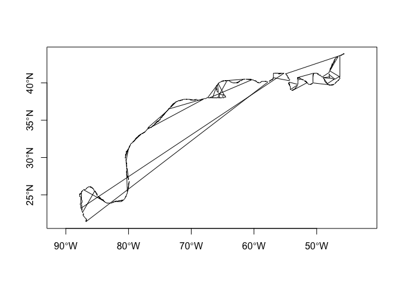

gstream
================

Serving Gulf Stream datasets directly from R.

## Requirements

[R v4.1+](https://www.r-project.org/)

[rlang](https://CRAN.R-project.org/package=rlang)

[dplyr](https://CRAN.R-project.org/package=dplyr)

[sf](https://CRAN.R-project.org/package=sf)

## Installation

Use the [remotes](https://CRAN.R-project.org/package=remotes) package to
install directly from github.

    remotes::install("BigelowLab/gstream)

### Data from US Navy

[FTP server](https://ftp.opc.ncep.noaa.gov/grids/experimental/GStream).
A manually prepared dataset that identifies the north wall and south
wall as unordered points.

``` r
suppressPackageStartupMessages({
  library(sf)
  library(dplyr)
  library(gstream)
  library(rnaturalearth)
})
```

    ## Warning: package 'sf' was built under R version 4.3.2

``` r
x = read_usn() |>
  dplyr::glimpse()
```

    ## Rows: 18,310
    ## Columns: 3
    ## $ date     <date> 2010-01-22, 2010-01-22, 2010-01-25, 2010-01-25, 2010-01-27, …
    ## $ wall     <chr> "north", "south", "north", "south", "north", "south", "north"…
    ## $ geometry <MULTIPOINT [°]> MULTIPOINT ((-80.2 25), (-8..., MULTIPOINT ((-77.5…

``` r
bb = sf::st_bbox(x)
coast = rnaturalearth::ne_coastline(scale = "medium", returnclass = "sf")

plot(x['wall'], pch = 3, axes = TRUE, reset = FALSE)
plot(sf::st_geometry(coast), add = TRUE)
```

<!-- -->

### Ordering USN data

The USN data is not ordered, that is the points for a given day are not
following a polyline. Is it possible to order them? If not, is it
possible to approximate an order?

``` r
d = dplyr::filter(x, date == as.Date("2020-12-19"), wall == "north")
plot(sf::st_geometry(d), type = "l", axes = TRUE)
```

<!-- -->

Maybe translate
[this](https://stackoverflow.com/questions/37742358/sorting-points-to-form-a-continuous-line)
into R? Or
[this](https://stackoverflow.com/questions/60495463/r-find-nearest-neighbor-for-selected-point)?

#### Find the most western point

This isn’t necessarily the starting point, but we can return to that
later.

It looks like it scanes south to north.

``` r
points = sf::st_geometry(d) |>
  sf::st_cast("POINT") |>
  sf::st_as_sf() |>
  sf::st_set_geometry("geometry") |>
  #dplyr::slice(100:105) |>
  dplyr::mutate(id = seq_len(dplyr::n()), .before = 1)

xy = sf::st_coordinates(points) |>
  dplyr::as_tibble()
nx = nrow(xy)

ilat = order(xy[["Y"]])
xy = slice(xy, ilat)
points = dplyr::slice(points, ilat)
plot(points, type = "b")
```

<!-- -->

``` r
xy = as.matrix(xy)
nx = nrow(xy)
nindex = rep(NA_real_, nx)
index = as.character(nindex)
index[1] = as.character(which.min(xy[,1]))
m = st_distance(points, points)
dimnames(m) = list(seq_len(nx), seq_len(nx))

for (i in seq(1, nx)){
  ix = order(m[index[i],]) # mixed 
  nindex[i+1] = ix[2] + if ((ix[2]) %in% nindex) 1 else 0
  index[i+1] = as.character(nindex[i+1])
}
```
